<div align="center">

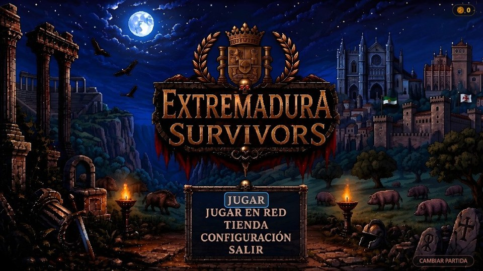

# Extremadura Survivors

**Un survivors-like en la Extremadura romana.** Aguanta treinta minutos entre las
ruinas de Emerita Augusta mientras la horda crece, sube de nivel eligiendo entre
tres armas cada vez, y acaba con la Loba Capitolina.

[](#)
[](#)
[](#)
[](#)
[](#)
[](#)
[](#)
[](#)
[](LICENSE)

[](https://sergiosanchezcustodio.github.io/extremadura-survivors/)
[](https://sergiosanchezcustodio.itch.io/extremadura-survivors)

</div>

---

## Jugar

Sin instalar nada, en el navegador:

- **[sergiosanchezcustodio.github.io/extremadura-survivors](https://sergiosanchezcustodio.github.io/extremadura-survivors/)** — servido desde este mismo repositorio
- **[sergiosanchezcustodio.itch.io/extremadura-survivors](https://sergiosanchezcustodio.itch.io/extremadura-survivors)**

Se recomienda mando, pero con teclado se juega igual. Y hay
**[manual de jugador](https://sergiosanchezcustodio.github.io/extremadura-survivors/manual/manual-jugador.html)**:
controles, los ocho personajes, el arsenal, el bestiario y los tres jefes.

<details>
<summary><b>En local, para desarrollar</b></summary>

```bash
python -m http.server 8000
```

Abrir `http://localhost:8000`. **No hay paso de build**: es JavaScript servido tal
cual. Sin `npm install`, sin bundler, sin transpilar. Se edita un fichero, se
recarga la pestaña y ya está.

Hace falta un servidor —no vale abrir `index.html` a doble clic— porque los
módulos ES6 no cargan por `file://`. `herramientas\jugar.ps1` levanta el
servidor y abre el juego de una vez.

</details>

<details>
<summary><b>Aplicación de escritorio para Windows</b></summary>

```powershell
powershell -ExecutionPolicy Bypass -File herramientas\empaquetar.ps1
```

Deja en `dist/extremadura-survivors-win64/` una carpeta con `Extremadura Survivors.exe`
que funciona a doble clic en cualquier PC con Windows: sin navegador, sin
servidor y sin instalar nada. La primera vez descarga NW.js —Chromium
empaquetado como aplicación, 200 MB— y lo deja en caché; las siguientes tardan
segundos.

El código del juego NO se compila ni se toca: los mismos `index.html`, `js/` y
`assets/` que sirve el servidor local van tal cual dentro del ejecutable.

**El resultado ocupa 520 MB y no entra en el repositorio**: una sola DLL de
Chromium pesa 297 y GitHub rechaza ficheros de más de 100 MB. Lo que se versiona
es el script; el ejecutable se genera cuando hace falta y se reparte como
release. Con `-Zip` sale además el comprimido listo para enviar (200 MB).

</details>

---

## Al arrancar

Tres pantallas antes del menú. La primera es la ficha del proyecto —con qué está
hecho, la licencia y el aviso de que se ha usado IA—, la segunda **presenta el
juego**, con el texto subiendo por el hueco de una placa de piedra que lleva la
bandera de Extremadura envolviéndola, y la tercera es la portada.

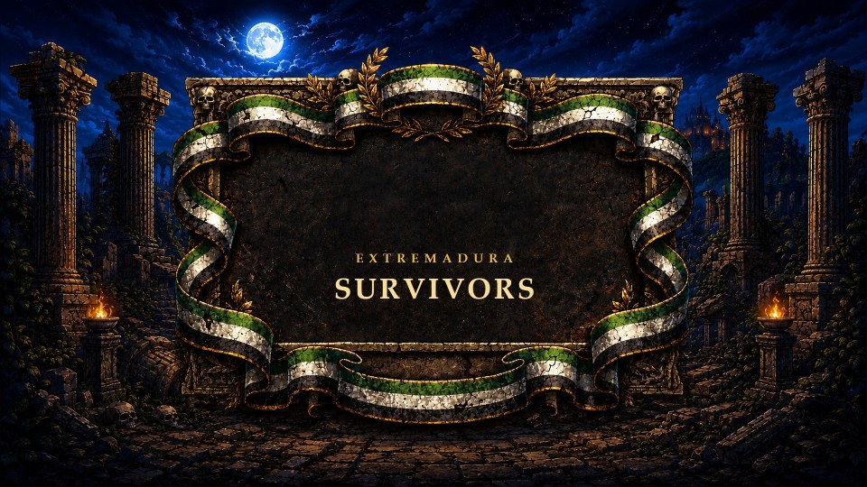

**Y hay narrador.** La intro y la historia de cada nivel las cuenta una voz grave
en español, y mientras habla la música se aparta. Los MP3 están horneados en
`assets/voz/`: el juego no habla con ningún servicio ni necesita internet para
sonar. El de cada nivel se busca por su identificador, así que narrar uno nuevo
es dejar su fichero ahí con el nombre correcto.

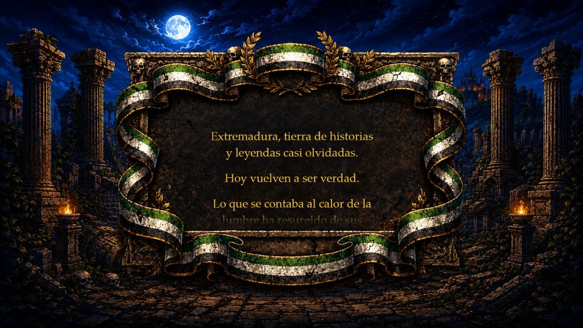

**Y la portada espera.** Las dos primeras se van solas —el logo a los ocho
segundos, el relato cuando acaba—, pero esta se queda: es el primer momento en
que el juego pide algo. Aquí entra el tema del título, y el aviso de pulsar no
está pintado en la lámina sino escrito encima, en la capa nítida, latiendo
despacio sin llegar a apagarse. Las antorchas de la ilustración arden de verdad:
el resplandor va con dos senos de períodos distintos para que no lata como un
metrónomo, y las pavesas suben, se van a rojo y se apagan.

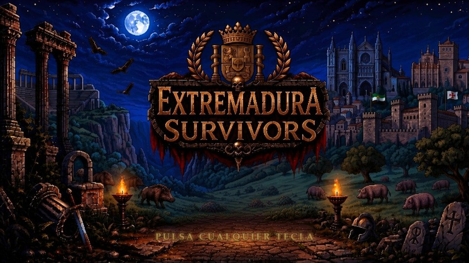

**Manda la voz, no el texto.** El relato no sube a ritmo fijo: reparte el tiempo
entre renglones según lo que cuesta *decir* cada uno, de forma que la frase que
se está narrando sea la que está en mitad de la placa. Con un ritmo constante
—que fue la primera versión— texto y voz coinciden al empezar y al acabar y se
separan por el medio: diez renglones de cada guion llegaban a narrarse cuando ya
no estaban a la vista. La voz entra además tres segundos tarde, porque un renglón
tiene que poder leerse *cuando* se dice, y para eso ha tenido que entrar antes.

Para pasar de pantalla valen `Espacio`, `Enter` y `Esc`, o `A`, `B`, `X`, `Y` y
`Start` en el mando; **no vale cualquier tecla**, que es como se perdía la intro
entera con un roce o con un mando boca abajo en el sofá. Y los relatos se saltan
**aguantando dos segundos**, con un aro que se cierra en la esquina: un minuto de
narración no puede irse por un botón mal apoyado.

La historia de cada sitio no va en la intro: se cuenta al elegirlo, justo antes
de jugarlo.

El menú principal que viene después está **quieto a propósito**: lo único que se
mueve son las dos antorchas. Llegó a tener estrellas titilando, nubes, un
relámpago y cuatro cosas más, y se quitaron todas. Una pantalla de menú no es una
postal animada: es donde se elige una opción, y siete cosas moviéndose le
disputan la atención a lo único que importa ahí, que es qué está señalado.

---

## La partida

Te mueves, las armas disparan solas. Cada gema que recoges te acerca al siguiente
nivel, y cada nivel son tres armas u objetos entre los que elegir. La horda no
para de crecer: al minuto 16 hay cientos de cuerpos en pantalla a la vez.


Treinta minutos, tres jefes por el camino y un contador que no perdona.

En el panel de cada jugador, bajo el retrato, hay **cinco corazones**: las vidas
que te quedan. Salen siempre los cinco —el hueco dice cuánto te falta por comprar
y el apagado cuánto has perdido— y al perder una, el corazón revienta en
esquirlas. Perder una vida ya no pasa desapercibido: el personaje **se encoge
hasta desaparecer y vuelve**, con un anillo, chispas y el mando vibrando. La
Moneda de Caronte te devuelve al sitio en el mismo fotograma en que te matan, y
eso, que es lo que la hace buena, era también lo que la hacía invisible.

Y cuando cae un jefe de los minutos 10, 20 o 30, **la horda sale por patas**: los
comunes corren a triple velocidad y se esfuman, y mientras el jefe siga en pie no
aparece nadie más. La pelea es contra él, no contra él y doscientos más. Los dos
de en medio dejan al morir un **cofre dorado** garantizado; la Loba, mil denarios
que te llevas a la partida siguiente.

### Lo que hay por el suelo

Por el escenario se rompen antorchas y se abren cofres, y de ahí salen cinco
cosas: comida, monedas, un imán que atrae todas las gemas del mapa, un
lanzallamas prestado y **el Reloj de Emerita**.

El Reloj para a la horda entera durante diez segundos — a toda, esté donde esté,
incluida la que aparezca mientras dura. Y mientras corre, **el mundo se queda en
blanco y negro** y una cuenta atrás de siete segmentos, en rojo, baja en la parte
de abajo de la pantalla. El gris lo hace todo el lienzo del juego de una vez, así
que el panel y la cuenta siguen en color sin que nadie tenga que hacer nada: son
lienzos distintos.

Un enemigo congelado además **no es un obstáculo**: se le atraviesa andando y no
hace daño al tocarlo. Es lo que convierte el objeto en la salida de verdad del
peor momento de una partida — quedar rodeado y que los cuerpos siguieran siendo
pared dejaba el pánico intacto, solo que en silencio.

---

## Cooperativo local

Hasta **cuatro jugadores** en la misma pantalla, cada uno con su panel en una
esquina. Quien cae deja un ataúd y un contador, y cualquiera puede ir a
levantarlo.


La cámara va con **correa**: sigue al centro del grupo y quien se queda atrás topa
con el borde, como en los beat'em ups de toda la vida. Es una consecuencia de
diseño, no una limitación — el juego corre a 480×270 con escalado entero, y
alejar la cámara al abrirse el grupo rompería la rejilla de píxeles que le da la
nitidez.

Cada mando que se enchufa suma un jugador con la partida en marcha, o `J` desde
el teclado.

---

## Cooperativo online

Hasta **cuatro jugadores en red**, cada uno en su casa, sin servidor: se juega
desde **JUGAR EN RED** en el título. Quien crea la partida genera un código y lo
manda por donde habléis —WhatsApp, Discord, lo que sea—; el otro contesta con el
suyo. Dos mensajes y a jugar.

Por la red viajan solo las **pulsaciones**, nunca el estado del mundo:
[lockstep](https://en.wikipedia.org/wiki/Lockstep_%28computing%29) determinista, la
misma técnica de los RTS clásicos. Cada máquina simula la partida entera por su
cuenta a partir de la misma semilla, así que el tráfico es mínimo y no hace
falta ningún servidor de partida — el código WebRTC conecta las máquinas
directamente. Con tres o cuatro jugadores, el anfitrión reenvía lo que pulsa
cada invitado a los demás.

Si se cae la conexión a mitad de partida, un cartel lo dice y ofrece
**RECONECTAR**: se repite el baile de códigos y la partida sigue exactamente
donde se quedó, sin reiniciar nada.

---

## Los héroes

Cada personaje lleva **su** arma, la que nadie más puede llevar. En cooperativo
eso garantiza que los cuatro arrancan jugando distinto, y el sorteo de subida de
nivel se encarga de que sigan sin repetirse.

Los cuatro de siempre —Eric, Lucy, Sara y Vicky— son gratis y lo seguirán
siendo. Detrás hay **cuatro más que se desbloquean en la tienda**, y la pantalla
de selección se recorre como un carrusel: los cuatro marcos de la ilustración
son una ventana sobre la lista, no la lista entera, y los héroes pasan por
detrás de la piedra como quien mira por una ventana. Los que todavía no son
tuyos se ven en penumbra con su precio, que es la única forma de saber que
están ahí.

Los cuatro de pago son **Helen, Julie, Say y Sofi**, y ya están dibujadas: cada
una con su GIF de dieciséis fotogramas, su retrato y su cuerpo entero para la
ficha, como las cuatro de siempre. **Y cada una con su estatura**: Helen es la
más baja de las ocho, Julie un poco más baja que Sara, Say mide lo que Vicky y
Sofi es la más alta. Es solo el dibujo — el círculo de colisión es el mismo para
todo el mundo, así que ser más alta no es recibir más golpes.

Lo único que les falta todavía es su ataúd —el dibujo que en cooperativo dice a
quién hay que ir a levantar—; mientras no lo tengan, quien cae deja en su sitio
el reloj de la reanimación.

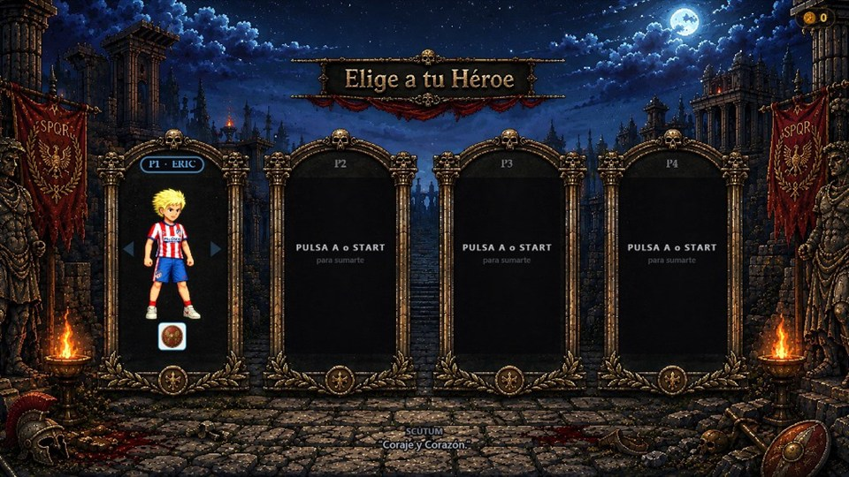

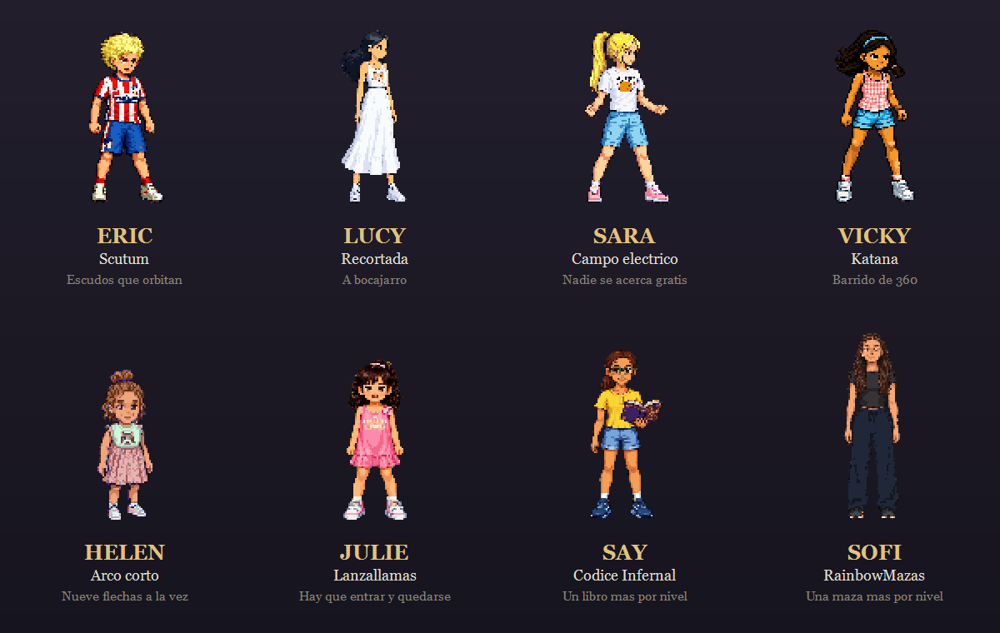

---

## Las mascotas

Antes de empezar eliges una, y te acompaña toda la partida. **Sube de nivel
contigo** y ninguna hace lo mismo que otra: unas te dan una estadística y otras
tienen habilidad propia, con su cadencia y su alcance.


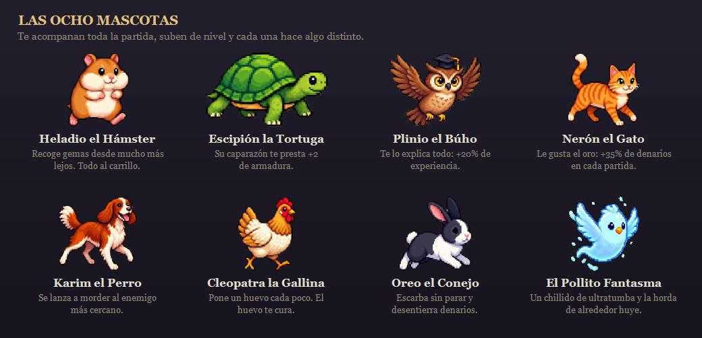

| | Qué hace |
|---|---|
| **Heladio** el Hámster | Recoge gemas desde mucho más lejos: +45% de radio |
| **Escipión** la Tortuga | Su caparazón te presta +2 de armadura |
| **Plinio** el Búho | Te lo explica todo: +20% de experiencia |
| **Nerón** el Gato | Le gusta el oro: +35% de denarios en cada partida |
| **Karim** el Perro | Se lanza a morder al enemigo más cercano, cada 1,8 s |
| **Cleopatra** la Gallina | Pone un huevo cada 9 s, y el huevo te cura |
| **Oreo** el Conejo | Escarba sin parar y desentierra denarios |
| **El Pollito Fantasma** | Un chillido de ultratumba y la horda de alrededor huye |

Las cuatro primeras cambian un número; las cuatro últimas **actúan**, y eso es lo
que las hace elegir distinto: un perro que muerde no es un porcentaje, es un
segundo aliado en pantalla.

Se compran una vez con denarios y se quedan desbloqueadas para siempre.

---

## Elegir dónde se juega

Lo último antes de empezar, cuando ya se ha decidido con quién. La pantalla
enseña **el recorrido entero**: Emerita Augusta arriba y, debajo, los seis
sitios que quedan por escribir —el CC The Lighthouse, Monfragüe, la Necrópolis,
Casas del Turuñuelo, Granadilla y Las Hurdes— apagados y con «próximamente». Un
mapa que solo muestra donde ya puedes ir no es un mapa. Cada nivel se abre al
**ganar** en el anterior: morir en el minuto 28 no abre nada.

De qué va cada uno y quién es su jefe —el Jancano en Monfragüe, el Macho Cabrío
en Las Hurdes— está en **[docs/niveles.md](docs/niveles.md)**.

A la derecha, **una ventana con el sitio señalado**: un trozo del mapa de
verdad, sin un solo personaje ni un solo bicho. No es una captura guardada — se
compone con las mismas piezas que usa la partida, el suelo pintado del nivel y
su decoración, así que el día que se mueva una columna la ventana lo enseña sin
que nadie rehaga una imagen.


Y elegido el sitio, **su historia** sube por la misma placa de piedra antes del
primer fotograma, narrada por la misma voz. Cada nivel cuenta la suya y vive en
su propio archivo de datos; se salta aguantando dos segundos, como la intro.


---

## La ficha

En cualquier momento de la partida, `Tab` abre la ficha del jugador: vida,
experiencia, las seis estadísticas, las armas con su nivel y los objetos que
llevas.


---

## El bestiario

De la serpiente que huye a la Loba Capitolina. **A escala real entre ellos**: el
mismo factor para todos, para que la diferencia de tamaño sea la de verdad y no
la que resultara cómoda de maquetar.

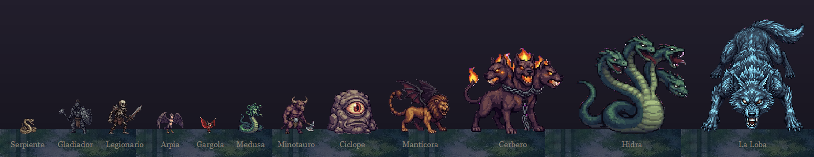

Cerbero entra en el minuto 10, la Hidra en el 20 y la Loba cierra la partida. Los
demás van llegando por oleadas, con élites que sueltan cofre y variantes doradas
que huyen en vez de perseguir.

---

## El arsenal

**58 armas en juego** —53 por sorteo y 5 evoluciones—, tres opciones cada vez que
subes de nivel. Una evolución pide el arma al 8, su pasivo, y un cofre de élite.

Hay **siete más en el catálogo que no salen**: Pistola, Escopeta, Lanzas gemelas,
Lanzagranadas, Honda balear, Lluvia de agujas y Artillería. No están borradas,
llevan una marca que las saca del sorteo, así que devolver una al juego es quitar
esa línea. Se hizo así porque un arma arrancada hay que reescribirla, y con ella
se van los números que costaron tardes de ajuste. En la lámina de abajo salen
todas, apartadas incluidas: es el arte del catálogo, no la lista del sorteo.

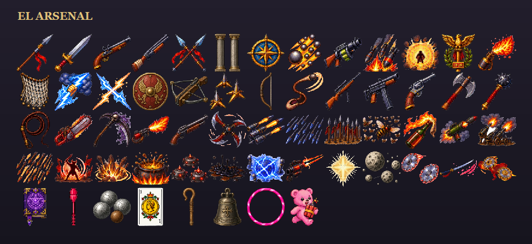

Desde el pilum y el gladius hasta el lanzallamas, las minas de proximidad, los
satélites en órbita y la tormenta de rayos de Júpiter.

Dos crecen contándose, y son las de las dos últimas heroínas. El **Códice
Infernal** de Say: un libro orbitando al empezar y diez al nivel 10, cada subida
despierta uno nuevo y todos giran más rápido. Y el **RainbowMazas** de Sofi, que
suelta mazas en direcciones al azar, **de dos en dos y de un color nuevo cada
nivel**: dos iguales al empezar y veinte al 10, las diez de su lámina por
parejas. Cada una se lleva por delante a dos enemigos antes de deshacerse.
En las dos, subir de nivel se ve antes de leer nada.

La ambientación va mezclada a propósito: honda balear junto a subfusil. Es una
decisión tomada, no un descuido — Mérida es una ciudad romana en la que vive
gente hoy.

### Los objetos

Además de las armas hay **29 objetos** que salen en las mismas cartas de subida
de nivel y que no disparan: cambian cómo funciona todo lo demás. Desde las
sandalias aladas o la lorica hasta la Pira funeraria, la Capa del erizo o el
Grial de Alconétar.

Dos cambian el juego más de lo que parece. La **Bandolera** y el **Zurrón** suben
a cinco las ranuras de armas y de objetos, y el panel de la esquina crece con
ellas en vez de encoger los huecos. Y **El Libro de las Sombras** pasa a un
enemigo a tu bando cada pocos segundos: se envuelve en un aura roja, **no se le
puede matar** mientras dura —ni tú, ni tus compañeros, ni la explosión de otro
poseído—, le pega a los suyos con su propio daño de contacto y a los cinco
segundos revienta.

Qué hace cada uno y las decisiones que se tomaron por el camino están en
**[docs/armas-y-objetos.md](docs/armas-y-objetos.md)**.

---

## Efectos generados por código

Ni un solo efecto está dibujado a mano. Los 41 se **hornean por fórmula** con
`herramientas/generar-efectos.ps1`, offline y sin dependencias.

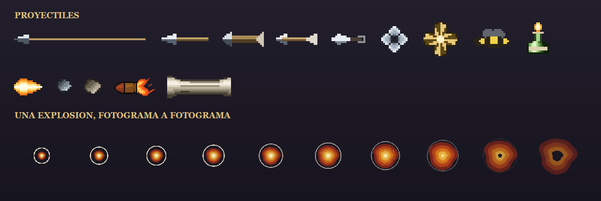

La observación que lo hace posible es que casi todo esto es geometría: una luna
son dos circunferencias y una resta, una red de pesca es una malla de rombos, y
lo que separa un pilum de una lanza y de un virote no es el dibujo sino las
proporciones — los tres salen de la misma función con otros números.

Lo que se gana frente a recortar de una lámina: la secuencia **existe de verdad**
(una explosión es el mismo dibujo evaluado en otro instante), el color es un
parámetro, es determinista —misma semilla, mismo PNG byte a byte— y se puede
reajustar mil veces sin coste.

Y cada familia trae su **comprobación por texto**, que es lo que evita abrir un
PNG para saber si algo salió bien: radio creciente, fotogramas vacíos, cobertura
del aro, píxeles de lámpara. Ese control ha cazado una red que era un disco con
agujeritos, unos pinchos apelotonados con un cuadrante vacío y una luz que nunca
llegó al fichero.

---

## La tienda

**Los denarios sobreviven a la muerte.** Cada partida —te salga bien o te maten
en el minuto tres— deja dinero, y ese dinero compra mejoras que valen en todas
las siguientes. Es lo que hace que una mala partida no sea una partida perdida.

Tres secciones:

<table>
<tr>
<td width="33%"><p align="center"><b>Potenciadores</b><br><sub>mejoras permanentes</sub></p></td>
<td width="33%"><p align="center"><b>Mascotas</b><br><sub>se desbloquean</sub></p></td>
<td width="33%"><p align="center"><b>Jugadores</b><br><sub>ocho, cuatro gratis</sub></p></td>
</tr>
</table>

### Los quince potenciadores

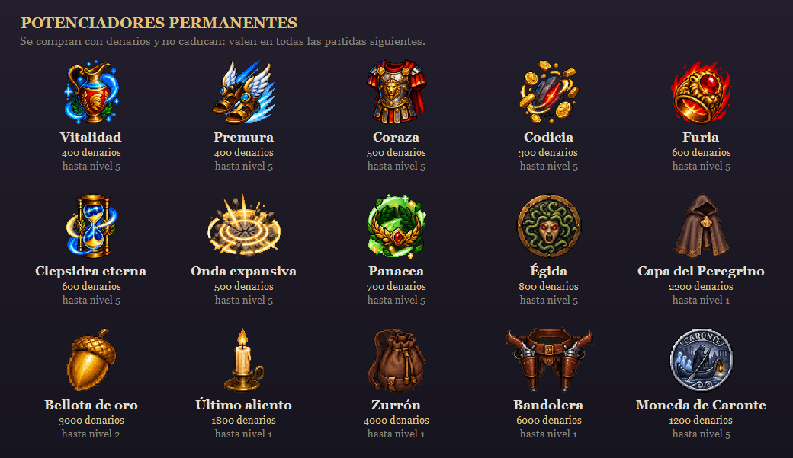

| Potenciador | Por nivel | Coste |
|---|---|---|
| **Codicia** | +5% de radio de recogida | 300 |
| **Vitalidad** | +4% de vida máxima | 400 |
| **Premura** | +2% de velocidad | 400 |
| **Coraza** | +1 de armadura | 500 |
| **Onda expansiva** | +2% de área de efecto | 500 |
| **Furia** | +3% de daño | 600 |
| **Clepsidra eterna** | −1,5% de recarga | 600 |
| **Panacea** | +0,15 de vida por segundo | 700 |
| **Égida** | +6 de escudo, que se recarga solo si no te golpean | 800 |
| **Moneda de Caronte** | Una vida extra por nivel: vuelves a media vida donde caíste | 1200 |

Cinco niveles cada uno, con el coste subiendo. Los valores son **pequeños a
propósito** al lado de los pasivos de partida —la clepsidra de partida da 4% de
recarga por nivel y esta 1,5%—: un pasivo lo llevas una partida y ocupa una de
tus cuatro ranuras, esto no caduca nunca.

Y los cofres de élite abren una **ruleta** de ocho casillas dentro de la partida,
que es la otra forma de que te toque algo bueno sin haberlo comprado.

---

## La copia en la nube

El progreso —denarios, héroes y potenciadores desbloqueados— se puede llevar de
un ordenador a otro. **Sin cuenta, sin correo, sin contraseña**: la identidad es
un código de 128 bits que el juego genera solo.

No es la fuente de la verdad, es una copia: el navegador sigue guardando donde
siempre, y si el servidor no contesta —o no hay servidor puesto— se juega
exactamente igual, guardando en local. Por debajo es un Worker de Cloudflare con
una base D1, los dos dentro del plan gratuito. Detalle completo en
[nube/LEEME.md](nube/LEEME.md).

---

## Cómo está hecho

**Restricciones no negociables**, y se cumplen todas:

| | |
|---|---|
| **Cero dependencias** | Solo HTML/CSS/JS con módulos ES6 nativos |
| **Canvas 2D puro** | Nada de WebGL ni librerías |
| **Object pooling** | Cero `new` durante la partida: todo se preasigna |
| **Spatial hash** | Colisiones nunca N² |
| **480×270** | Escalado entero, `imageSmoothingEnabled = false` |
| **Reproducible** | Misma semilla, mismas oleadas |

### Cuatro carpetas

- **`js/core/`** — motor: bucle de juego, entrada, cámara, RNG con semilla,
  carga de recursos, pool de objetos, spatial hash.
- **`js/datos/`** — **datos puros, cero lógica.** Bestiario, armas, pasivos,
  potenciadores, personajes, jefes y niveles. Todo lo que un balance nuevo
  necesita tocar vive aquí, nunca en `sistemas/`.
- **`js/sistemas/`** — la lógica que LEE esos datos: director de oleadas,
  colisiones, armas, progresión, jefes, audio.
- **`js/entidades/`** y **`js/ui/`** — lo que se mueve por pantalla y lo que se
  dibuja encima.

### Rendimiento

Objetivo del plan: 800 entidades activas a 60 fps. Medido llenando el pool de
enemigos por encima de su objetivo con `E.avanzar(60)` desde la consola —
midiendo el paso de lógica en sí, no los fps que reporta la pestaña:

```
1000/1000 enemigos activos  →  5,91 ms de lógica  +  2,7 ms de render
```

Bien por debajo de los 16,6 ms que exige 60 fps, con margen de sobra.

Dentro hay **Controladores**: la silueta de un Xbox Series X y, al lado, una
tabla de tres columnas —**acción**, cómo se hace **con el mando** y cómo **con el
teclado**—. La pieza de la fila señalada **se enciende sobre el dibujo**: no hay
líneas de guía porque son ocho controles en un mando pequeño y saldrían todas
cruzadas. Está ahí porque quien enchufa un mando por primera vez no tiene forma
de saber que la ficha del personaje se abre con VIEW.

La silueta es de Sergio y es **línea sobre transparencia**, así que el juego la
**tiñe** antes de dibujarla —tal cual, negra sobre el velo oscuro de esa
pantalla, no se vería— y guarda el resultado en vez de repetirlo sesenta veces
por segundo.

<details>
<summary><b>Opciones</b></summary>

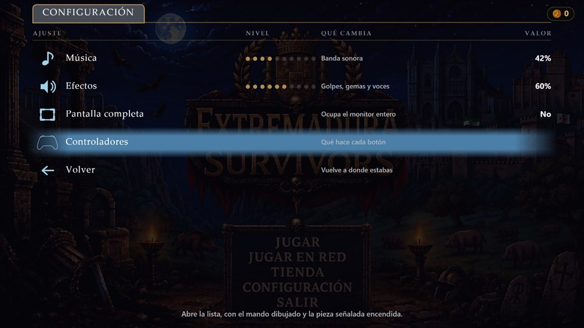

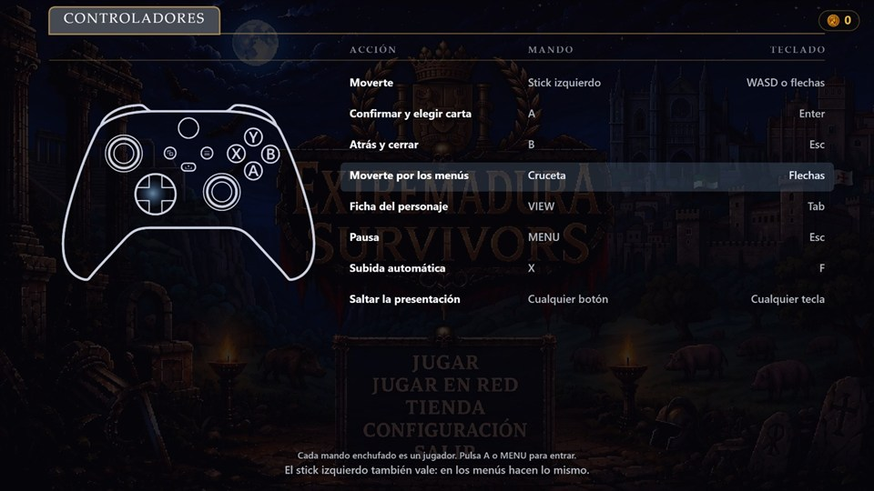

</details>

---

## Herramientas

Todas offline, en PowerShell y sin dependencias. Ninguna forma parte del juego.

| Herramienta | Qué hace |
|---|---|
| `jugar.ps1` | Levanta el servidor y abre el juego (`jugar.bat` a doble clic) |
| `procesar-assets.ps1` | Convierte `resources/` en sprites y escribe el atlas |
| `generar-efectos.ps1` | Hornea por código las 41 hojas de efectos |
| `montar-galeria.ps1` | Compone las láminas de este README, y con `-Capturas` normaliza las capturas de pantalla |
| `ver-assets.ps1` | Describe imágenes sin abrirlas |
| `empaquetar.ps1` | Genera la aplicación de escritorio |
| `empaquetar-web.ps1` | Genera el zip para itch.io (o cualquier host estático) |
| `publicar-itch.ps1` | Sube ese zip a itch.io con `butler` |
| `medir-lapida.ps1` | Dónde caen los renglones del menú del título, sobre la lámina |
| `medir-marcos.ps1` | Dónde caen los cuatro marcos de la pantalla de selección |

Y las pruebas, que abren un navegador de verdad y se contestan solas:

| Prueba | Qué comprueba |
|---|---|
| `npm run probar` | Las siete de siempre: matemáticas deterministas, códigos de invitación, búfer de pulsaciones, sincronización, progreso y nube |
| `probar-determinismo.js` | Que la misma partida sale igual dos veces, que los pools sucios de otra partida no la cambian, y que la huella de 3600 fotogramas sigue siendo la de siempre |
| `probar-aguante.js` | Veinte minutos de partida seguidos (`[minutos] [jugadores]`): que nada se vuelve NaN, que ningún pool se agota, que los contadores no se desvían y que la memoria no crece |
| `probar-navegacion.js` | Que se llega a cada pantalla y, sobre todo, que se puede volver |
| `probar-heroes.js` | Que los héroes de pago se compran, se cobran y solo entonces se pueden elegir |
| `probar-partida-en-red.js` | Dos o cuatro navegadores jugando la misma partida por WebRTC, con caída de red y reenganche |
| `medir-rendimiento.js` | Qué cuesta un paso con 800 enemigos, y el perfil de CPU por función (`logica`, `dibujo`, `memoria`) |

---

## Estado

Fases 1-8 del plan completas (`prompt-emerita-survivors.md`): movimiento y
combate, oleadas, armas y progresión, escenario con objetos sólidos y ancho
limitado, los tres jefes y presentación completa.

Y por encima del plan, lo pedido después: cooperativo local con reanimación,
mascotas con niveles, tienda de tres secciones, ruleta en los cofres, resumen
final por jugador, música compuesta, aplicación de escritorio, las dos pantallas
de presentación del arranque y **los relatos narrados**, con el texto acompasado
a la voz.

Cómo se publica una versión —Pages va solo, itch.io va a mano, y el sello del
atlas es lo que evita que el navegador sirva imágenes viejas— está en
**[docs/publicar.md](docs/publicar.md)**.

**Lo que viene**: los seis sitios que faltan — el CC The Lighthouse, Monfragüe,
la Necrópolis, Casas del Turuñuelo, Granadilla y Las Hurdes — añadiendo un nivel
a la vez. Qué es cada uno está en **[docs/niveles.md](docs/niveles.md)**; el
contrato para escribirlo, en **[docs/anadir-un-nivel.md](docs/anadir-un-nivel.md)**,
con lo que es copiar un fichero de datos y lo que todavía obliga a tocar código.

El juego ya sabe tener más de uno. Después de elegir héroe y mascota se elige
**dónde**, en una pantalla que enseña el recorrido entero —los seis sitios que
faltan salen apagados, con «próximamente»— y donde un nivel se abre al ganar en
el anterior. Elegido el sitio, **su historia** sube por la placa de piedra antes
del primer fotograma: cada nivel cuenta la suya, escrita en su propio archivo de
datos. Y la intro del arranque ya no cuenta Mérida, presenta el juego entero.

En cooperativo online el nivel lo elige el anfitrión y viaja en el saludo con la
semilla y los personajes. Falta escribir los cinco que quedan.

---

<details>
<summary><b>Nota sobre las imágenes de este README</b></summary>

Hay dos clases, y conviene no confundirlas:

- **Capturas de pantalla** (`docs/capturas/`) — el juego funcionando. Salen de
  jugar y fotografiar, reducidas a 960 de ancho con
  `montar-galeria.ps1 -Capturas`. Se bajaron de 43,6 MB a 1,5 MB: 960 porque la
  columna de un README en GitHub mide unos 900 px, y todo lo más ancho lo reduce
  el navegador emborronando el pixel art.
- **Láminas compuestas** (`docs/`) — bestiario, personajes, arsenal, efectos,
  potenciadores y mascotas. No son capturas: son sprites recortados de sus hojas
  y colocados sobre el suelo del nivel, que genera `montar-galeria.ps1`. Se
  rehacen solas cuando cambia el arte, que es justo lo que unas capturas hechas
  a mano no hacen.

  Y las dos últimas **leen `js/datos/`**, no una lista escrita a mano: nombres,
  costes, niveles y descripciones salen del mismo sitio del que los saca el
  juego. La primera versión no lo hacía y se notó — dibujó los potenciadores con
  una hoja de iconos que la tienda no usa, y dejó fuera a dos de las ocho
  mascotas por haberlas contado mirando la carpeta de assets.

</details>

<details>
<summary><b>Claude Code setup</b></summary>

First time running Claude Code on this machine?

```bash
./scripts/setup-claude.sh
```

This script copies the recommended Claude Code settings:
- **Effort**: low (optimized for balance tweaks & graphics)
- **Model**: claude-opus-5 (best performance/cost)

If you want to use different settings, edit `~/.claude/settings.json` locally
(not in repo).

</details>

## Licencia

Este proyecto se distribuye bajo la **GNU General Public License v3.0**. Texto
completo en [`LICENSE`](LICENSE).

En corto: puedes copiar, ejecutar, modificar y redistribuir el código, incluso
con fines comerciales, siempre que cualquier versión modificada que
redistribuyas se publique también bajo GPL-3.0 y con el código fuente
disponible.

La licencia cubre el código y el arte original del proyecto. No concede -ni
puede conceder- derechos sobre marcas o contenido de terceros que aparecen
como referencia dentro del juego (por ejemplo, la equipación del Atlético de
Madrid en uno de los personajes).
